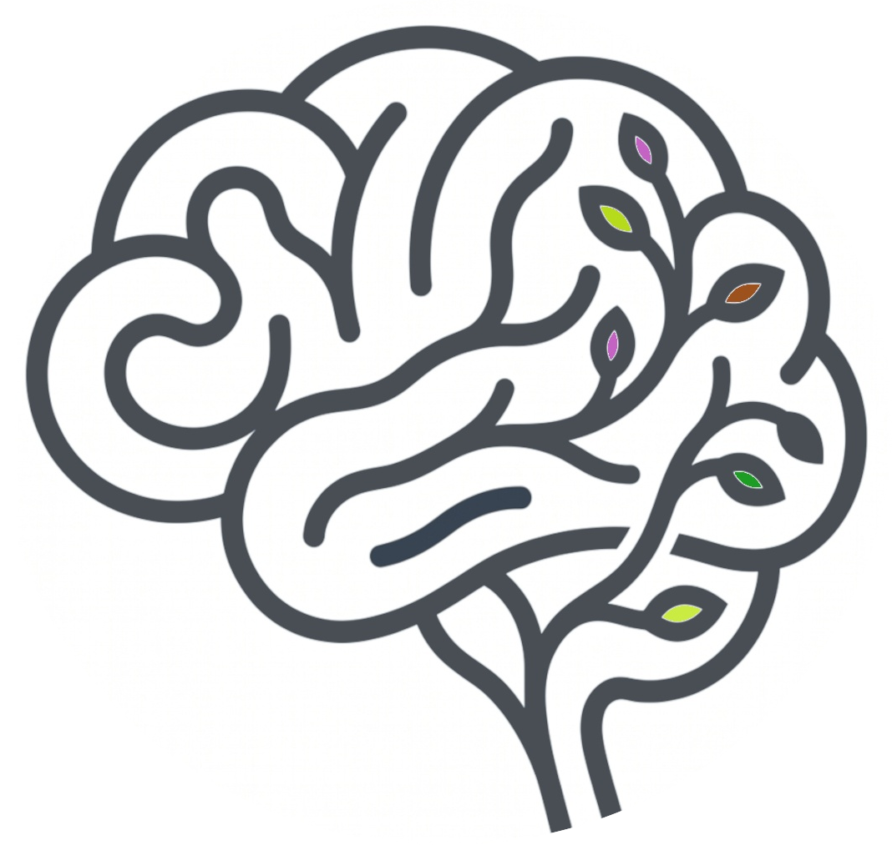
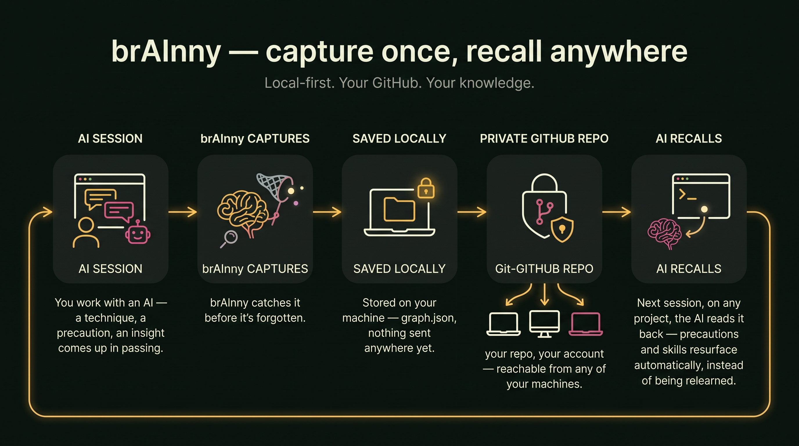
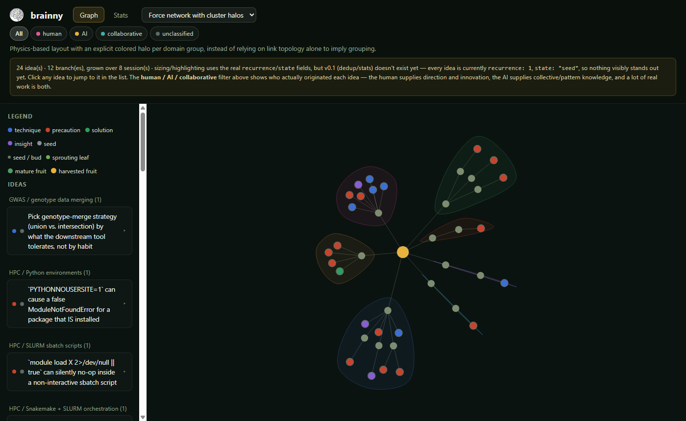
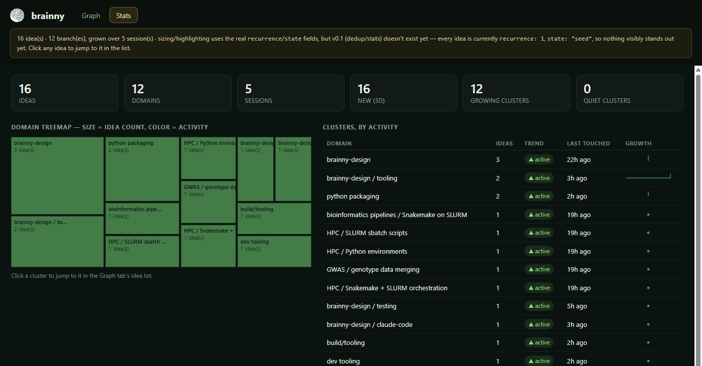
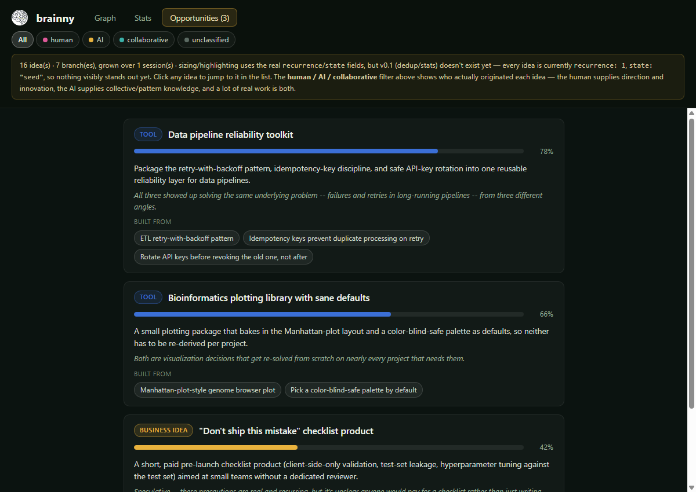
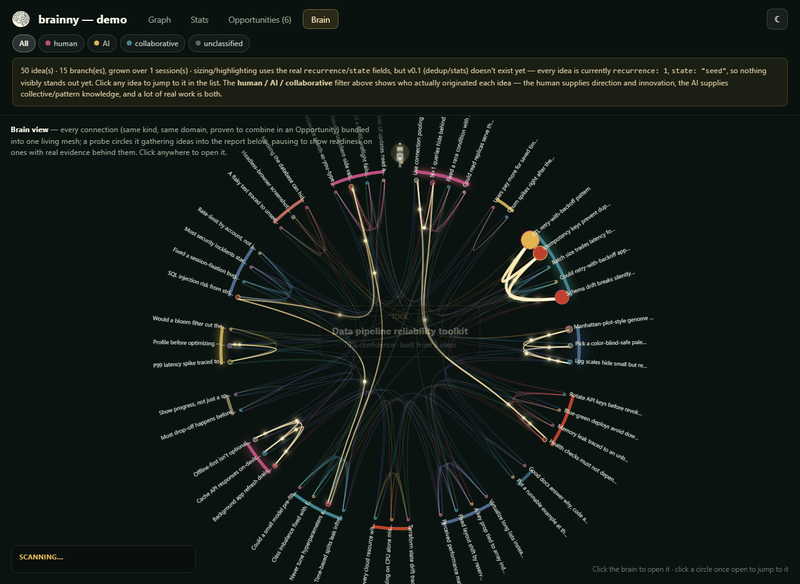
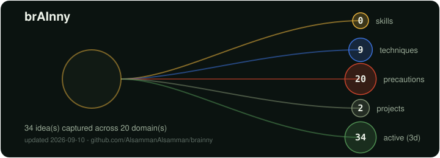

<div align="center">



# br<font color="#e8b23d">AI</font>nny

**catches your ideas before the wind**

[](LICENSE)
[](pyproject.toml)
[](OPERATIONS.md)

</div>

> **Every session with AI, you invent things you never write down — a
> precaution, a trick, a working fix — and by tomorrow they're gone with
> the wind. brAInny catches them before they blow away, so you can come
> back to any of them later, reuse them instead of re-discovering them,
> and watch what you know actually compound, session after session.**

<p align="center">
  
</p>

**[What it does](#the-problem-this-solves) ·
[How it works](#how-it-works-in-one-picture) ·
[Install](#install) ·
[Use it](#use-it) ·
[Status](#status) ·
[Layout](#layout)**

---

## The problem this solves

You're deep in a task with an AI assistant, solving something else
entirely, and along the way you figure out a trick, hit a gotcha you'll
absolutely hit again, or land on a working approach you're proud of. It
was never the *point* of the session — so it isn't written anywhere. The
session ends, the terminal closes, and it's gone. Weeks later you pay the
same cost to re-learn the same lesson.

**brAInny is not a note app.** It's built specifically to catch that
throwaway residue — the stuff nobody would think to write down on
purpose — and turn it into something durable:

- A **technique** you invented gets saved, so next time it's a lookup,
  not a rediscovery.
- A **precaution** you learned the hard way gets remembered, so you never
  pay for the same mistake twice.
- A **solution** to a fiddly problem stays reachable, so future-you can
  just reuse it.
- A stray **insight** that isn't useful yet gets kept as a seed — if it
  keeps coming back across sessions, brAInny notices and lets it grow.
- A reusable **skill** — how a project should be structured, how a
  specific analysis or plot should be built — gets kept as a described
  procedure *plus* real evidence: a code excerpt, an equation, or a
  table structure kept inline, and/or a small attached script, table, or
  plot — each shown as a badge on the idea so it's visible at a glance
  which ones have something to literally follow, not just read about.
- Ideas that genuinely **combine into something bigger** — a tool, a
  website, a statistical module, a business idea — get proposed as an
  **Opportunity**, with an honest AI-assigned confidence weight, in the
  dashboard's own tab. Not automatic: pure semantic judgment, and most
  passes propose nothing at all.

It works for anyone who works with AI, not just developers — a
precaution, a structure, a working approach is the same shape of thing
whether you write code, contracts, prose, or research.

**Every idea also remembers who came up with it** — `human`, `ai`, or
`collaborative`. Not who typed it: who actually originated it. The human
supplies direction and innovation; the AI supplies collective, pattern-level
knowledge; a lot of real work is genuinely both. `/brainny-catch-this` is
always `human` (you're the one pointing at it); the ambient skills judge it
per idea. The dashboard's Graph, Stats, and idea list all filter by this —
see it below.

---

## How it works, in one picture

The diagram above is the pitch; this is the literal mechanics:

```
[ your AI session ]
        │  a lightweight skill watches for reusable moments and emits them
        ▼
   brainny capture           ← the CLI: validates, dedups, files it
        ▼
  brainny-out/graph.json     ← your durable, growing memory for this project
        │
        ├── graph.html       interactive dashboard — browse, search, revisit
        └── (optional) sync to one shared "central" brain across all your projects
```

Nothing runs on a server, nothing leaves your machine unless you
explicitly point it at a central folder — and even then, syncing to
GitHub is a separate, explicit command, never silent. `graph.html` itself
has zero network dependency, too — D3 is vendored and baked directly
into the file, not pulled from a CDN, so it renders identically offline,
behind a firewall, or years from now regardless of what's still online.

**Not locked to one AI.** The brain (the `brainny` CLI + `graph.json`) is
plain, assistant-agnostic Python — the skills in `skills/brainny/` are
just markdown instructions plus shell commands. The ones built and tested
so far target Claude Code, but nothing about the design is Claude-only:
any assistant that can read an instruction file and run a shell command
can drive brainny the same way.

<p align="center">
  
</p>

<p align="center"><sub>Graph tab — force network with cluster halos. The row of pills under the tabs filters by who originated each idea.</sub></p>

<p align="center">
  
</p>

<p align="center"><sub>Stats tab — domain treemap, growth trends, kind + origin breakdown.</sub></p>

<p align="center">
  
</p>

<p align="center"><sub>Opportunities tab — AI-proposed combinations, sorted by confidence weight, linked back to the ideas each one draws from.</sub></p>

A fourth tab, **Brain**, is a different way to look at the same ideas:
every connection between them — same kind, same domain, and (brightest)
proven to combine in an Opportunity — bundled into one living mesh that
resolves into a brain silhouette, no literal neuron dots needed. An
old-style robot probe circles it continuously, pausing on ideas with real
evidence behind them to show a percent-ready readout, and gathering a
live scrolling report as it passes. Click anywhere to open the mesh into
real, labeled, clickable idea circles.

<p align="center">
  
</p>

<p align="center"><sub>Brain tab — same 50-idea example dataset as the screenshots above, not a mockup. Every view, including this one, has a day/night toggle (top-right) that defaults to your system's preference and remembers your choice.</sub></p>

All screenshots (and the preview above) are from the same fabricated
example dataset (50 ideas across 14 domains, every kind/origin,
attachments, snippets, and 6 proposed Opportunities) — built to show the
full dashboard, not the maintainer's real ideas. **Want to click around
it yourself, not just look at screenshots?**
[Open the live example dashboard](https://htmlpreview.github.io/?https://raw.githubusercontent.com/AlsammanAlsamman/brainny/master/examples/demo/graph.html) —
see [`examples/demo/`](examples/demo/).

---

## Install

```bash
git clone https://github.com/AlsammanAlsamman/brainny
cd brainny
pip install -e ".[dev]"
```

That puts a `brainny` command on your PATH — usable from **any** project
directory, not just this repo — plus the importable `brainny` package.
(Not published to PyPI yet — the name is confirmed free, publishing is
just a deliberate later step.)

`python -m brainny` and `python -m brainny.cli` both work too, from any
directory (including the parent of your clone).

**Windows note.** With the Microsoft Store build of Python, the `Scripts`
directory that receives `brainny.exe` is often *not* on `PATH` — pip prints a
`WARNING: The script brainny.exe is installed in '…\PythonXX\Scripts' which is
not on PATH`. Add that `…\Scripts` folder to your user `PATH` (or just run
`python -m brainny`).

---

## Use it

**1. Capture something reusable**, by hand or via the assistant skill:

```bash
brainny capture path/to/entries.json --project myproj --session s1
```

(`prompts/capture.md` shows the shape of an entry. In Claude Code, the
`skills/brainny/` skills do this for you — see below.)

Or, mid-session, just point at it: **`/brainny-catch-this the retry
approach we just built for the API client`** — searches the whole session
for whatever you describe (not just a recent window), and always tells you what it
captured. Unlike the ambient skills below, this one doesn't second-guess
whether it's worth keeping — you already decided that.

For a reusable procedure rather than a fact, use **`/brainny-catch-skill
how the GWAS manhattan plot should be made`** instead — same
user-directed contract, but it captures `kind: skill` and looks for real
evidence in the conversation (a script, a small table, a small plot) to
attach as proof, via:

```bash
brainny attach idea_0031 manhattan.py --type code --description "plotting script"
brainny attach idea_0031 expected_columns.csv --type table --description "required column format"
brainny attach idea_0031 manhattan_example.png --type plot
```

Attachments are copied into `brainny-out/attachments/<idea-id>/`, shown
as small badges (code / plot / table) on the idea in the dashboard, and
capped at 2&nbsp;MB each — small enough to guide future use, not a copy
of the full dataset or output.

Not everything worth keeping needs a whole file, though — a code excerpt,
an equation, a config block, a table's column structure can just live
directly on the idea via the `snippet` field (capped at 4000 characters),
no `brainny attach` call needed. Any capture skill can fill it in; the
dashboard renders it as monospace text in the idea's expanded view, with
its own small pencil badge next to the title.

**Ask whether ideas combine into something bigger:**
**`/brainny-synthesize`** looks over everything already captured in the
project — not just this session — for genuine combinations that could
support each other toward a tool, website, statistical module, or
business idea. Each proposal gets an honest 0.0–1.0 confidence weight
(never inflated to look better) and shows up in the dashboard's own
**Opportunities** tab, linked back to the ideas it's built from. This is
pure AI judgment — nothing deterministic proposes it — so most passes
propose nothing at all, same GATE discipline as every other capture skill:

```bash
brainny propose opportunities.json --project myproj --session s1
```

**2. See what you've kept:**

```bash
brainny status              # counts, domains, last capture, sync state
brainny query                # your ideas as a terminal tree
brainny query --html          # a browsable dashboard: brainny-out/graph.html
                                #   Graph tab: radial tree / force network, click-to-inspect
                                #   Stats tab: domain treemap, growth trends, kind + origin breakdown
                                #   Opportunities tab: AI-proposed combinations of ideas
                                #   Brain tab: edge-bundled mesh + a probe that gathers a live report
                                #   day/night theme toggle, top-right, in every tab
brainny open                  # open that dashboard in your browser
brainny open --central          # ...or the central folder's copy of this project instead
brainny open --central --project X  # ...or an explicit project's central copy, from anywhere
brainny search "docker"        # find anything by keyword, tag, domain, kind
brainny recall retry api client  # search THIS project + every project in your central folder
brainny recent --days 7          # what you've captured lately
```

**3. Let it capture itself, ambiently.** Install the skills once
(`skills/brainny/*.md`, plus their global counterparts under
`~/.claude/skills/`) and every Claude Code session will:
- **once, ever, per machine** — on the first session after install, if
  no central folder is set up yet, ask whether you want one (and where,
  and whether to back it with GitHub) before ever touching anything;
  never asks again after that, whatever you answered;
- quietly scan the last ~25 minutes of conversation for anything worth
  keeping, and file it without interrupting you — most cycles catch
  nothing, and that's correct;
- once, at the start of the session, check whether anything's drifted
  from your shared central brain and ask before syncing it;
- right after your first message, quietly check whether anything you've
  captured before — in *this* project or any other one synced to your
  central brain — is relevant to what you're about to do, and mention it
  briefly if so. This is the proactive-recall half: everything else here
  only captures, this is what actually feeds it back to you.

Nothing is ever pushed to GitHub without you asking for it, in that
moment, every time.

**Every Claude Code command brainny adds:**

| Command | Runs | What it does |
|---|---|---|
| `/brainny` | manually, end of a session | full two-pass review of the whole session (project-aware + project-blind) |
| `/brainny-catch` | manually, or every ~25 min in the background | lightweight scan of the last ~25 min for anything worth keeping; silent when it finds nothing |
| `/brainny-catch-this <description>` | manually, whenever you point at something | searches the *whole* session for what you describe and captures it; always tells you what it did |
| `/brainny-catch-skill <description>` | manually, whenever you point at a reusable procedure | same as above, but captures `kind: skill` and attaches evidence (code/plot/table) via `brainny attach` |
| `/brainny-sync-check` | automatically, once per session | checks for local drift and for an overdue GitHub push, asking before either |
| `/brainny-onboarding` | automatically, once ever per machine | offers to set up a new central folder, or download an existing one, plus optional GitHub, on first use |
| `/brainny-recall` | automatically, once per session, after your first message | surfaces anything relevant you've captured before — in this project or any other one — before the task starts |
| `/brainny-synthesize [focus]` | manually, whenever you want to check | reviews everything captured in the project for genuine combinations, proposing each with an honest confidence weight via `brainny propose` |

All of these are installed globally, once, and then work in any project.

**4. Optionally, keep one brain across every project** (the onboarding
skill above offers to do this for you on first run — or by hand):

```bash
brainny config set-central ~/brainny-central          # point at a new shared folder
brainny config set-central ~/brainny-central --clone <git-url>  # ...or download an existing one (another machine, GitHub)
```

Once a central folder is configured, `brainny capture` and `brainny
attach` mirror to it **automatically, immediately, on every call** — no
extra step, and nothing to remember. You only need `brainny sync` by hand
for two cases: backfilling ideas that were captured *before* a central
folder existed, or `brainny sync --push` to also commit & push, if the
central folder has a GitHub remote.

Sync only ever flows project → central. Central never overwrites a
project's own copy unless you explicitly ask for that, and none of this
ever touches git on its own — pushing to GitHub is always a separate,
explicit step. If the central folder is GitHub-backed, `brainny status`
tracks how long it's been since the last push and flags it as due once
`sync-interval-days` has passed (default **1 day**) —
`brainny-sync-check` asks before pushing.

**See everything together, not one project at a time:**

```bash
brainny central              # summary: idea count per project, across the whole central folder
brainny central --html       # one merged dashboard: <central-folder>/graph.html
brainny central --open       # ...and open it
```

This is the actual "one central brain" — every project synced into the
central folder, shown together in a single dashboard with a **project**
filter alongside the existing origin filter (only appears once there's
more than one project to distinguish). It's a merge, not a reconciliation:
ideas are concatenated as-is, not deduplicated — full cross-project dedup
is still open work (SEED.md's v0.4 milestone). `brainny central` also
flags any idea whose own provenance names a different project than the
folder it's sitting in — a real, if uncommon, sign that `brainny capture`
got run from the wrong directory at some point.

Found one of those? Fix it:

```bash
brainny reassign idea_0004 idea_0005 --to the-right-project
```

Moves the given idea(s) out of the current directory's local graph (and
its own central mirror) and into the target project's central copy,
renumbered to avoid colliding with ids already there. Only the target's
*central* copy gets written — there's no way to know where that
project's actual working directory lives on disk, so its own local
`brainny-out/` is left alone (and stays that way; central never writes
back into a project's local copy, per the asymmetric sync rule above).

**A small, optional activity badge for somewhere public** (a GitHub
profile README, say) — counts and shape only, never idea content:

```bash
brainny badge                        # merged across every synced project -> ./brainny-badge.svg
brainny badge --local                # just the current directory's own graph
brainny badge --out assets/badge.svg # write it somewhere specific
```

<p align="center">
  
</p>

A tiny animated robot rides the badge itself: it travels out along one
branch at a time, growing or shrinking to match that branch's count (big
for a busy precautions count, small when a category is empty), heads
back, moves on to the next branch — and every so often it just sits at
the hub and laughs for a moment before its next lap. Pure SMIL (no
JavaScript runs in an ``-embedded SVG), so it animates the same way
on a GitHub profile page as it does here.

Nothing gets uploaded anywhere — `brainny badge` only ever writes a local
`.svg` file, same "no silent push" rule as everything else here. Shows:
idea count, kind breakdown (skills/techniques/precautions), domains,
project count, and how many ideas were touched in the last 3 days — not
"novelty," since that scoring model isn't built yet (see Status below);
this recency count uses the same honest proxy the dashboard's own Stats
tab already does.

**Putting it on a GitHub profile, step by step:**

1. Generate it, pointed at a file inside a **public** repo you can push
   to (this `brainny` repo works fine — that's what `assets/badge-example.svg`
   above actually is):
   ```bash
   brainny badge --out assets/badge.svg
   ```
2. Commit and push that file, same as any other change:
   ```bash
   git add assets/badge.svg && git commit -m "Update brainny badge" && git push
   ```
3. Grab its raw URL: `https://raw.githubusercontent.com/<user>/<repo>/<branch>/assets/badge.svg`.
4. If you want it on your **profile page** specifically (not just this
   repo), that lives in a separate, special repo named exactly after your
   username — `github.com/<username>/<username>`. Clone it, add the image
   to its `README.md`:
   ```bash
   git clone https://github.com/<username>/<username>.git
   cd <username>
   ```
   ```markdown
   
   ```
   then `git add README.md && git commit -m "Add brainny activity badge" && git push`.
5. Re-run step 1–2 any time you want the badge to reflect newer activity
   — your profile page re-fetches the raw URL on every view, so nothing
   on the profile-repo side needs to change again.

No step here runs on its own — capturing, syncing, and badge generation
never push to GitHub by themselves, so this is always something you (or
an assistant you've explicitly asked) does deliberately.

---

## Status

**v0 · seed** — the core loop above is real and tested (136 tests).
Capture *and* proactive recall (`brainny recall` + the `brainny-recall`
skill) both work today. Not yet built: automatic dedup/novelty scoring so
`recurrence`/`state` truly evolve over time, decay for neglected ideas,
and an MCP server for tighter, tool-level AI access (recall today goes
through the CLI via a skill, not a direct protocol). See `OPERATIONS.md`
for the full build order and `SEED.md` for the complete design rationale
— both are as honest about what's *not* built yet as what is.

---

## Layout

```
brainny/                 the CLI + engine (Python, assistant-agnostic)
skills/brainny/          the capture skills (assistant-facing prompts)
prompts/                 entry + project-nature templates
tests/                   136 tests, see SEED.md §6 for the testing philosophy
brainny-out/             where captures land when you use brainny *on*
                         this repo (gitignored — same as in any project;
                         not shipped, this is per-user local data)
examples/demo/           fabricated example dashboard, committed on purpose
                         — see "Want to click around it yourself?" above
assets/icon.png          brand mark
SEED.md                  the living design doc — read this first
OPERATIONS.md            how it actually runs day to day
```

Read `SEED.md` for the constitution, architecture, and entry schema.
Read `OPERATIONS.md` for the command surface, ambient capture, and the
central/GitHub sync model in full.

---

## Contributors

| Name | Contact |
|---|---|
| Alsamman M. Alsamman | [aalsamman100@gmail.com](mailto:aalsamman100@gmail.com) |
| Muhammad M. Adeel | [m.muzammal.adeel@outlook.com](mailto:m.muzammal.adeel@outlook.com) |
