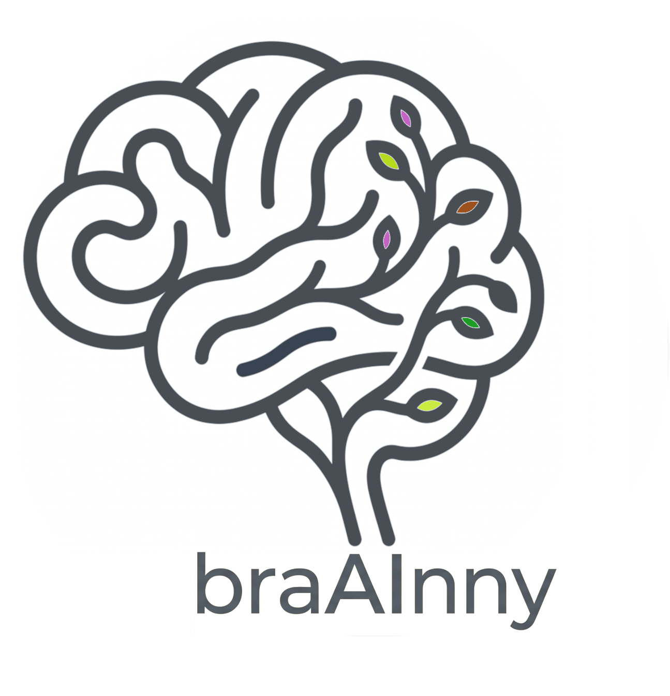

# brAInny



**brAInny remembers *how you work* — the techniques you invent and the
precautions you learn while solving problems with AI — so you stop
re-learning your own lessons.**

Not a note app. It captures the procedural residue that gets generated in
passing while you solve something else with AI, and would otherwise
evaporate when the session ends: techniques, precautions, solutions, and
insights, plus stray ideas that might grow into something later.

For anyone who works with AI — not any one field. See `SEED.md` §0 for
the full pitch and examples across domains.

## Status

**v0 · seed** (see `SEED.md` §7 for the full roadmap). Working today:

- `brainny capture <entries.json> --project <name> --session <id>` —
  validate entries, write them into `brainny-out/graph.json`, and refresh
  `brainny-out/graph.html`.
- `brainny query` — print the graph as a terminal tree.
- `brainny query --html` — (re)write `brainny-out/graph.html`: a
  dashboard ([D3](https://d3js.org/), CDN-loaded) with a dropdown
  switching between a **radial tree** (domains branching from a center,
  ideas as leaves at the rim) and a **force-directed network** (physics-
  based layout with an explicit colored halo per domain group), plus an
  itemized accordion list — click a title to unfold summary/detail/
  trigger/tags. Clicking an idea in either graph opens + scrolls to its
  entry in the list, so the list is where its info actually shows. Ideas
  are sized/highlighted by growth state and kind — real fields, though
  inert until v0.1 (`dedup.py`/`stats.py`) makes `recurrence`/`state`
  actually vary. Static file, no server — falls back to a plain terminal
  tree if D3 can't load. (This replaced an earlier standalone 3D
  network-graph implementation after a round of exploring alternatives
  in a throwaway `examples/` folder — since folded in and deleted.)

- `brainny status` / `search <term>` / `recent [--days N]` / `open` —
  quick-look commands over data that already exists: idea counts and
  central-sync state, keyword/tag/domain search, what's been captured
  lately, and opening `graph.html` without hand-typing the path.
- `brainny config get [key]` / `config set <key> <value>` — local
  settings in `~/.brainny/config.json` (`central-folder`,
  `github-remote`, `sync-interval-days`, `project-nature`).
- `brainny config set-central <path>` / `brainny sync` — point this
  machine at a central folder and push this project's current graph
  there (`<central>/<project>/graph.json` + `graph.html`). Always local →
  central, never the reverse. `status` reports whether the central copy
  is in sync or has drifted.
- `brainny sync --push` — if the central folder is a git repo with a
  remote *you've already set up yourself* (brainny never runs `git init`
  or `git remote add`), also commit + push. Never runs without `--push`
  for that call or the durable `git-auto-push: true` setting — pushing is
  never silent.
- `/brainny-catch` — the lightweight ambient sibling of the full
  `/brainny` capture skill (`skills/brainny/catch.md`): scans just the
  recent slice of conversation, single-pass, silent when nothing
  qualifies, one non-blocking receipt line when something is caught.
  Also installed globally (`~/.claude/skills/brainny-catch/`) and wired
  into a standing rule in the user's `~/.claude/CLAUDE.md`: at the start
  of every Claude Code session, in every project, it self-schedules a
  recurring ~25-minute loop running this skill — ambient capture without
  being asked, anywhere `brainny` is installed.
- `brainny-sync-check` skill (`skills/brainny/sync-check.md`, also
  installed globally) — runs once at the start of every session (not on
  a loop): checks `brainny status` for drift between the local and
  central copies, and if there's any, asks permission in plain chat
  before running `brainny sync`. Silent when there's no central folder
  configured or nothing's drifted. Stands in for a true "every 2-3 days"
  background trigger, which turned out not to be buildable — see
  `OPERATIONS.md` step 7 for why.

Not yet built: dedup/novelty/decay (`stats.py`, `dedup.py`), `grow`,
`neglected`, the MCP server (`serve`), git hooks, and true cross-project
reconciliation. Each stub command in the CLI says which
roadmap stage it lands in. See `OPERATIONS.md` for the full build order.

## Installation

Not on PyPI yet — the name (`brainny`) is confirmed free there, but
publishing is a separate, explicit decision, not made yet (SEED.md §5,
OPERATIONS.md §6 step 8). Until then, install from source:

```bash
# to use brainny in another project:
pip install "brainny @ git+https://github.com/<you>/brainny"   # once pushed to a remote
# or, from a local clone:
pip install /path/to/brainny

# to work on brainny itself:
git clone <this repo> && cd brainny
pip install -e ".[dev]"
```

Either way you get a `brainny` command on PATH (works from *any* project
directory — see OPERATIONS.md §6 step 6) plus the importable `brainny`
package.

## Quick start

```bash
pip install -e ".[dev]"
pytest tests/                    # 55 tests, all green

# hand-write an entries.json (see prompts/capture.md for the shape), then:
brainny capture path/to/entries.json --project myproj --session s1
brainny query
brainny status
```

## Layout

```
brainny/                 the body (Part 2 — AI-agnostic Python)
skills/brainny/SKILL.md  the capture prompt (Part 1 — AI-facing)
prompts/                 capture + project-nature prompt templates
tests/                   layered test strategy, see SEED.md §6
brainny-out/             this project's own brain (graph.json + sessions/)
assets/logo.jpg          brand mark
SEED.md                  the living design doc — read this first
```

Read `SEED.md` for the constitution (§1), the architecture (§2-3), the
entry schema (§4), and how testing an LLM-in-the-loop system actually
works (§6). Read `OPERATIONS.md` for how brAInny actually gets invoked
day to day — the command surface, ambient background scanning, the
central/GitHub sync model, packaging, and branding.
